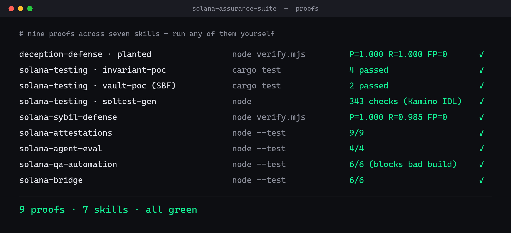

# Solana Assurance Suite

**The verification & ship-safety layer for Solana — seven focused skills, and every one ships a runnable proof.**



> A progressively-loaded **hub** for Claude Code / Codex. `solana-dev` and the protocol skills help you *build*; this suite makes sure what you built **actually works and is safe to ship**. Extends [solana-dev-skill](https://github.com/solana-foundation/solana-dev-skill); MIT.

## Why a suite

Across the ecosystem, skills help you *write* Solana code. Almost nothing helps you **prove it's correct, safe, and ready** — and the work that does exist is scattered. This suite is that missing layer, unified by one principle the whole field mostly skips: **evidence over claims — every skill here ships an executable proof a judge (or you) can run.**

It's structured exactly like the kit itself describes: *a progressively-loaded skill hub that routes to the best skills.* You load the hub, pick the sub-skill your task needs, and only that one's references load.

## The seven skills

| Skill | Solves | Runnable proof |
|-------|--------|----------------|
| [**deception-defense**](skills/deception-defense) | **Catch the lie before a judge or user does** — UI that claims success/liveness/verification it can't back up (fake-green on a reverted tx, hardcoded "LIVE", fake "verified" badges, dead CTAs, fabricated metrics) | deception-scan **precision 1.000 / recall 1.000 / FP 0** (7 patterns) |
| [**solana-testing**](skills/solana-testing-skill) | Prove a program correct before mainnet — Mollusk/LiteSVM/Trident-fuzz/invariants/coverage/CU + an IDL→adversarial-suite generator + a Mainnet-Readiness gate | invariant-poc **4✓**, real SBF Mollusk **2✓**, soltest-gen on escrow **+ Kamino Lending (51 ix → 343 checks)** |
| [**solana-qa-automation**](skills/solana-qa-automation-skill) | The full-stack dApp **release gate** + human-level e2e against a **real Phantom wallet** (built from two real production pipelines + a human-like testing methodology) | release-gate **6/6** (blocks on fail OR skip); Phantom e2e scaffold |
| [**solana-sybil-defense**](skills/solana-sybil-defense) | Keep airdrops/mints fair — catch sybil farms (incl. fresh-funder cohorts) **without** punishing real users | sybil-scan **precision 1.000 / recall 0.985 / FP=0**, beats the naive filter |
| [**solana-attestations**](skills/solana-attestations-skill) | The Solana Attestation Service credential lifecycle — issue & **verify safely**; proof-of-human gating | sas-verify **9/9** (every bypass rejected) |
| [**solana-agent-eval**](skills/solana-agent-eval-skill) | Evaluate a Solana AI agent's decisions (right tool/program/accounts) + CI regression gate | eval-run **4/4** (gate fires on regression) |
| [**solana-bridge**](skills/solana-bridge-skill) | Bridge cross-chain safely — CCTP v2 / Wormhole NTT / messaging / deBridge + the hack-mapped guards | bridge-guards **6/6** (replay/finality/decimal/emitter) |

## How they compose

```
build (solana-dev)
  → solana-testing        prove the program
  → solana-bridge         verify cross-chain moves
  → solana-sybil-defense + solana-attestations   eligibility = not-a-farm AND attested-human
  → solana-agent-eval     prove the agent's decisions (if you ship an agent)
  → deception-defense     the truth pass — nothing on screen claims success it can't prove
  → solana-qa-automation  roll it ALL into one release gate + human-level Phantom e2e
```

The QA release gate is the capstone: it ingests a per-layer manifest (unit → e2e → contract →
formal → load → lighthouse → security → uptime) and returns one BLOCK/PASS verdict — the other
five skills feed layers into it.

## Install

```bash
./install.sh                  # all six → ~/.claude/skills
./install.sh testing qa       # a subset (testing|qa|sybil|attestations|agent-eval|bridge)
```

Each sub-skill is also independently installable (`skills/<name>/install.sh`) and independently
MIT-licensed, so the suite can be merged whole or cherry-picked into the kit.

## Proof — run it yourself

```bash
# program testing
( cd skills/solana-testing-skill/examples/invariant-poc && cargo test )
# release gate / agent-eval / attestations / bridge / sybil (zero-dep, Node ≥18)
( cd skills/solana-qa-automation-skill/examples/release-gate && node --test )
( cd skills/solana-agent-eval-skill/examples/eval-run && node --test )
( cd skills/solana-attestations-skill/examples/attestation-verify && node --test )
( cd skills/solana-bridge-skill/examples/bridge-guards && node --test )
( cd skills/solana-sybil-defense/examples/planted-cluster && node generate.mjs && node verify.mjs )
# deception-defense (zero-dep)
( cd skills/deception-defense/examples/planted-deception && node verify.mjs )
```

Aggregate results: [EVAL_REPORT.md](EVAL_REPORT.md).

## Structure

```
solana-assurance-suite/
├── SKILL.md            # the hub router (entry point)
├── README.md  LICENSE  install.sh  EVAL_REPORT.md
└── skills/
    ├── deception-defense/           solana-testing-skill/
    ├── solana-qa-automation-skill/  solana-sybil-defense/
    ├── solana-attestations-skill/   solana-agent-eval-skill/
    └── solana-bridge-skill/
```

## License

MIT — see [LICENSE](LICENSE). Built for the [Solana AI Kit](https://github.com/solanabr/solana-ai-kit) bounty.
